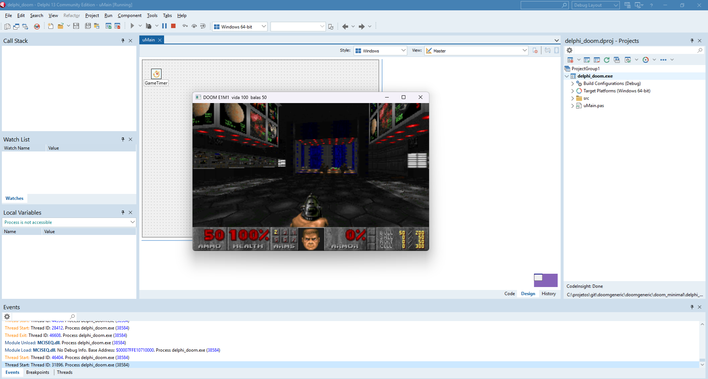

# delphi_doom



**Vídeo:** [DOOM rodando em Delphi](https://youtu.be/mSZptjBd-x0)

DOOM generic portado de **[python_doom](https://github.com/vagucs/python_doom)** para **Delphi FireMonkey**.

Por **Wagner Nunes da Silva**

- vagucs@bol.com.br
- vagucs@vagucs.com.br
- vagucs@gmail.com
- [www.vagucs.com.br](https://www.vagucs.com.br)
- [LinkedIn](https://www.linkedin.com/in/wagner-nunes-da-silva-b0a15360)

Esta árvore é aquele motor em Python, agora em Pascal. O laço, o mapa e o renderer ficam em Delphi. Um formulário FireMonkey é a janela, o teclado e o bitmap. Não há SDL2 nem Allegro. O mesmo projeto aponta para Windows, Android e iOS. No Windows as setas movem. No Android as mesmas ações são botões na tela, e o telefone fica deitado.

English version: [README.md](README.md)

---

## O que é este projeto

`python_doom` é um motor de DOOM condensado e jogável, em Python. Este diretório é a **mesma peça de estudo**, reescrita em Delphi:

- Janela e cópia da tela: **FireMonkey** (`TForm`, `TImage`, `TBitmap`)
- Framebuffer: 320×200, esticado numa janela de 640×480
- Laço: um timer do FireMonkey avança o jogo e pinta o quadro
- Renderer: BSP, paredes com textura, planos de chão e teto, sprites, o sprite da arma
- Mapa: VERTEXES, LINEDEFS, SIDEDEFS, SECTORS, SEGS, SSECTORS, NODES, THINGS, BLOCKMAP, REJECT
- Jogo: andar, portas, elevadores, interruptores, saída, itens, armas, barra, automapa no Tab, som `DS*`, música MUS→MIDI, menu no Esc, contagem, derretimento ao trocar de fase, inimigos que olham, perseguem e atacam

É preciso um IWAD legal (shareware `doom1.wad` ou comercial `doom.wad` / `doom2.wad`). Este repositório não traz WAD comercial. O shareware `DOOM1.WAD` pode entrar num pacote Android. Um WAD comercial fica fora do repositório e fora de qualquer pacote que você publicar.

É um **port educacional condensado**: o motor é Pascal, e a camada nativa é só o que o FireMonkey ainda não faz (MIDI no Windows, e a trilha de áudio no Android).

Fora desta árvore:

- Rede, joystick, CD de áudio

---

## Proposta educacional

Este projeto é uma **peça de estudo**. O port em Python já tirou o pré-processador e os arrays 1-based do Harbour. O port em Delphi pergunta outra coisa: **o que muda quando a janela é um formulário FireMonkey**, para um projeto só compilar para Windows, Android e iOS a partir do RAD Studio, sem biblioteca SDL para distribuir.

O que ele pretende ensinar:

- **Python, depois Delphi.** Abra `python_doom/doom/` ao lado de `delphi_doom/src/`. Os nomes ficam perto (`Thrust`, `FixedMul`, `AsI32`) para os dois arquivos ficarem lado a lado.
- **Estouro de 32 bits, escrito.** `Integer` já tem 32 bits. Um produto que pode estourar alarga para `Int64` e volta com `AsI32` / `AsU32`. `FixedDiv` usa divisão para baixo, como o `//` do Python.
- **Leitura 0-based.** Lumps do WAD, nós da BSP e linhas do menu continuam 0-based, como no Python.
- **Onde o Pascal basta.** Colunas, chão, sprites, thinkers e o menu rodam em Pascal. O FireMonkey é a janela. O MCI do Windows toca MIDI. O Android mistura os efeitos e um sintetizador pequeno numa `AudioTrack` só.

Caminho sugerido:

1. Abra `delphi_doom.dproj` e aperte F9, depois leia `uMain.pas` — arranque, timer, entrada.
2. Compare `src/Doom.Compat.pas` com `python_doom/doom/compat.py`.
3. Abra `src/Doom.Render.pas` ao lado de `python_doom/doom/render.py`.
4. Siga uma porta do **Espaço** em `src/Doom.Player.pas` até `src/Doom.Specials.pas`.
5. Siga um tiro do **Ctrl** em `src/Doom.Player.pas` até `src/Doom.Enemy.pas`.

---

## De Python para Delphi

Listas em Python são 0-based. Arrays dinâmicos do Delphi também. Lumps do WAD, nós da BSP e linhas do menu conservam esse índice.

| Python (`python_doom`) | Delphi (`delphi_doom`) |
| --- | --- |
| `thing.x` | `Thing.X` |
| `None` | `nil` |
| `items[0]` | `Items[0]` |
| classe | `class` |
| `int` sem limite | `Integer` tem 32 bits; alargue para `Int64` e use `AsI32` |
| `&`, `\|`, `^` | `and`, `or`, `xor` |
| `x >> n` | `UShr32` / `SHar32` |
| `a // b` | `FixedDiv` (para baixo) |
| `fixed_mul` / `fixed_div` | `FixedMul` / `FixedDiv` |
| framebuffer `bytearray` | bytes da paleta, depois um bitmap do FireMonkey |
| pygame | FireMonkey |
| `+=` | `X := AsI32(Int64(X) + ...)` |

Escrever um campo da classe fica visível para quem chamou, do mesmo jeito que um objeto em Python.

### Lado a lado: `P_Thrust`

Python (`doom/player.py`):

```python
def thrust(mo, angle, move):
    mo.momx += fixed_mul(move, fine_cos(angle))
    mo.momy += fixed_mul(move, fine_sin(angle))
```

Delphi (`src/Doom.Player.pas`):

```pascal
procedure TPlayer.Thrust(Ang: Cardinal; Move: Integer);
begin
  FMomX := AsI32(Int64(FMomX) + FixedMul(Move, FineCos(Ang)));
  FMomY := AsI32(Int64(FMomY) + FixedMul(Move, FineSin(Ang)));
end;
```

O `.` continua `.`. `AsI32` devolve a soma em 32 bits. `FMomX` é o impulso que o resto do tic já lê.

---

## Tecnologia

| Camada | Este port | Python (`python_doom`) |
| --- | --- | --- |
| Linguagem | Delphi, RAD Studio 13 (Studio 37.0) | Python 3.10+ |
| Janela, teclas, cópia | FireMonkey | pygame 2.x |
| Cópia da paleta | Pascal, depois `TBitmap` | numpy |
| Efeitos | `waveOut` no Windows, `AudioTrack` no Android, PCM em 11025 Hz | mixer do pygame |
| Música | MIDI pela MCI no Windows. No Android a MUS vira MIDI e um sintetizador toca na mesma trilha | MCI no Windows, ou pygame |
| IWAD | os mesmos lumps | os mesmos lumps |
| Compilação | F9 no IDE. O `run.bat` só abre o projeto | `pip install -r requirements.txt` |

O renderer é Pascal. Não há arquivo C para compilar nem DLL da SDL para copiar.

O iOS está no projeto para uma compilação depois, no Mac. Som e música, hoje, são Windows e Android.

---

## Desempenho

Neste PC a janela FireMonkey fica em cerca de **30 FPS**. Esse é o topo desta versão. Um timer só avança o jogo e pinta o quadro, então o número do `-fps` é a velocidade do jogo. O intervalo do timer é 28 ms, e o timer do Windows cai perto de 30.

A mesma comparação dos outros ports (320×200, janela, IWAD shareware). Aquelas árvores continuam em 35 Hz e o `-fps` mostra quantas vezes pintam. Esta árvore pinta e avança junto, então 30 é o quadro e o ritmo.

| Port | FPS típico |
| --- | --- |
| Harbour (`doom_hb`) | ~12 |
| Python (`python_doom`) | ~8 |
| PHP (`php_doom`) | ~20 |
| Delphi (`delphi_doom`) | ~30 |
| Node (`node_doom`) | ~100 |
| Java (`java_doom`) | ~180 (travado no vsync) |

O Pascal compilado fica à frente do interpretador Python na mesma máquina. O timer do FireMonkey é o que segura esta versão em 30.

---

## Como rodar

RAD Studio 13 (Studio 37.0). Esta árvore compila pelo IDE. Abra `delphi_doom.dproj` e aperte F9. Escolha Win32, Win64 ou Android 64 bits. A plataforma Android 64 bits precisa estar instalada antes (Ferramentas, Gerenciar Plataformas). O `run.bat` só abre o projeto.

A janela é 640×480. O quadro é 320×200, esticado.

No Windows o jogo entra assim que acha um IWAD. No Android ele para primeiro na tela do WAD. Veja abaixo.

---

## WAD

É preciso um IWAD legal. O shareware `DOOM1.WAD` é o arquivo usual. Os comerciais `DOOM.WAD` e `DOOM2.WAD` funcionam do mesmo jeito e não devem ser commitados nem publicados dentro de um pacote.

### Windows

Sem `-iwad`, o carregador procura `DOOM1.WAD`, `doom1.wad`, `DOOM.WAD`, `doom.wad`, `DOOM2.WAD` e `doom2.wad`, nesta ordem: pasta de documentos, pasta pessoal, diretório atual, pasta do executável e as pastas pai dessas.

```
delphi_doom.exe -iwad ..\DOOM1.WAD
delphi_doom.exe ..\DOOM1.WAD -warp 1 1
```

### Android, dentro do pacote

O telefone não vê o WAD que está no PC. Coloque o arquivo no APK para o primeiro arranque já ter o jogo.

1. Abra **Project, Deployment**.
2. Adicione o WAD, por exemplo `DOOM1.WAD`.
3. O caminho remoto fica `assets\internal\`.

O `System.StartUpCopy` copia `assets\internal` para a pasta de documentos do aplicativo quando ele abre. A lista mostra cada `.wad` dessa pasta. O sistema de arquivos do Android diferencia maiúsculas, então conserve o nome que você adicionou.

Toque no arquivo e depois em **Jogar**.

### Android, download

A mesma tela tem um campo de endereço. Cole uma URL `https://` que termine em `.wad`. Um `?consulta` depois do nome é ignorado. **Baixar** grava o arquivo na pasta de documentos e mostra o percentual no botão e na barra debaixo do campo.

O arquivo só fica se os quatro primeiros bytes forem `IWAD` ou `PWAD`. Aí ele entra na lista. Toque nele e em **Jogar**.

Use um endereço que você possa buscar. Um `http://` simples costuma ser recusado no Android 9 ou mais novo. A linha amarela mostra esse erro. O projeto já pede a permissão de internet.

O Windows não mostra essa tela.

---

## Teclas

Controles clássicos do DOOM.

### Movimento e ações

| Tecla | Ação |
| --- | --- |
| Setas | Frente, trás, virar. No Android, o direcional |
| **Shift** | Correr. No Android, **Run** liga e desliga |
| **Alt** | Andar de lado (segurar). No Android, **Side** liga e desliga |
| **Ctrl** | Atirar. No Android, **Fire** |
| **Espaço** / **E** | Usar / abrir porta. No Android, **Use** |
| **Enter** | Confirmar no menu. No Android, **Fire** também faz isso |
| **Esc** | Menu. No Android, o botão **ESC** no alto |
| **Backspace** | Voltar no menu. No Android, **Use** faz isso com o menu aberto |
| **Tab** | Automapa |
| **F1** | Ajuda |
| **F2** | Gravar |
| **F3** | Carregar |
| **Gun** | Só no Android. Próxima arma que você tem |

**Y** confirma sair, no menu.

### Truques

Digite durante a fase, com o menu fechado. Sem Enter.

| Código | Efeito |
| --- | --- |
| **IDDQD** | Modo deus |
| **IDKFA** | Todas as armas, munição, chaves e armadura |
| **IDFA** | Armas, munição e armadura |
| **IDCLIP** | Atravessa parede. O jogador acompanha o piso em que está |
| **IDCLEV** + mapa | Troca de fase |
| **IDMUS** + mapa | Troca a música |

---

## Parâmetros de linha de comando

Valem no alvo Windows. No Android a tela escolhe o WAD no lugar de `-iwad`.

### IWAD

| Parâmetro | Descrição |
| --- | --- |
| `-iwad arquivo.wad` | IWAD a carregar |
| `arquivo.wad` | A mesma coisa, sem `-iwad` |
| `-file wad [wad…]` | PWADs extras depois do IWAD |

### Vídeo

| Parâmetro | Descrição |
| --- | --- |
| `-crt` | Linhas de varredura sobre o quadro |
| `-fps` | Quadros por segundo no canto. Conta as pinturas deste timer |
| `-fullscreen` | Começa em tela cheia |

### Jogo

| Parâmetro | Descrição |
| --- | --- |
| `-warp e m` | Pula o título e começa no episódio `e` mapa `m`. Um número só é um mapa de Doom II |
| `-skill n` | Dificuldade, de 1 a 5 |
| `-nomonsters` | Não cria inimigos |
| `-nosound` | Sem efeitos e sem música |
| `-nomusic` | Sem música |

A troca de fase derrete a tela. As partidas ficam em `doomsavN.sav`, ao lado do executável.

---

## Organização

```
delphi_doom.dpr      entrada
delphi_doom.dproj    projeto do RAD Studio (Win32, Win64, Android, Android64, iOS)
uMain.pas            formulário, timer, botões do Android, escolha do WAD
uMain.fmx            leiaute do formulário
run.bat              abre o projeto
src/                 motor
screenshot/doom.png  a foto do topo
docs/                QR codes de doação
```

| Caminho | Python |
| --- | --- |
| `src/Doom.Compat.pas` | `doom/compat.py` |
| `src/Doom.Wad.pas` | `doom/wad.py` |
| `src/Doom.VVideo.pas` | `doom/v_video.py` |
| `src/Doom.Tables.pas` | `doom/tables.py` |
| `src/Doom.RData.pas` | `doom/r_data.py` |
| `src/Doom.Render.pas` | `doom/render.py` |
| `src/Doom.World.pas` | `doom/world.py` |
| `src/Doom.Player.pas` | `doom/player.py` |
| `src/Doom.Specials.pas` | `doom/specials.py` |
| `src/Doom.Enemy.pas` | `doom/enemy.py` |
| `src/Doom.Sound.pas` | `doom/sound.py` e `doom/mus2mid.py` |
| `src/Doom.Menu.pas` | `doom/menu.py` |
| `src/Doom.Status.pas` | `doom/status.py` |
| `src/Doom.Inter.pas` | `doom/wi_stuff.py` |
| `src/Doom.Wipe.pas` | `doom/wipe.py` |
| `src/Doom.AutoMap.pas` | `doom/am_map.py` |
| `src/Doom.Finale.pas` | `doom/finale.py` |
| `uMain.pas` | a entrada do Python, mais o formulário FireMonkey |

---

## Linhagem

1. **[python_doom](https://github.com/vagucs/python_doom)** — Python + pygame
2. **delphi_doom** — Delphi FireMonkey (esta árvore)

---

## Doe

### Patrocínio no GitHub

[github.com/sponsors/vagucs](https://github.com/sponsors/vagucs)

### Ethereum

`0x1b64038A2b1DB73ABd0068d8B9B0d1dC5a90C5F1`


### PIX

Chave: `vagucs@bol.com.br`


